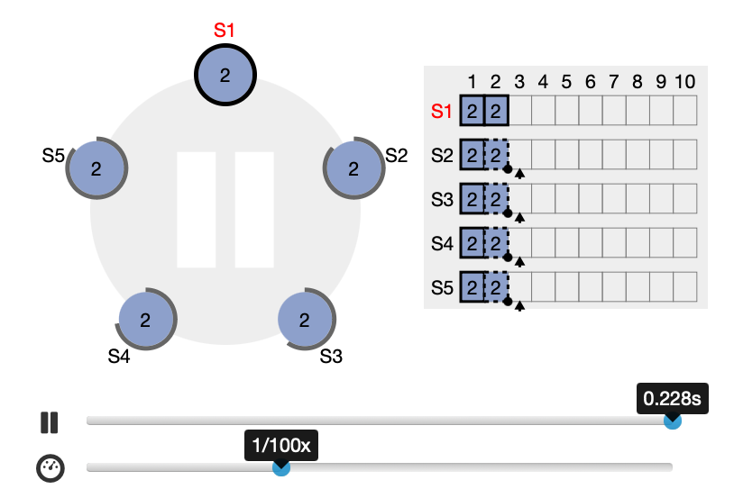
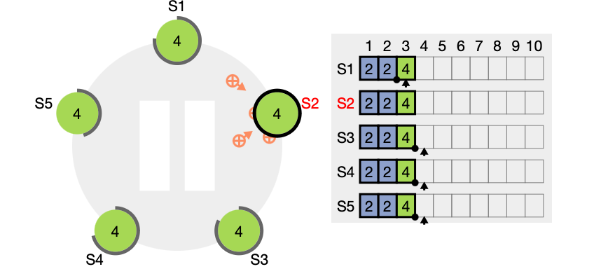
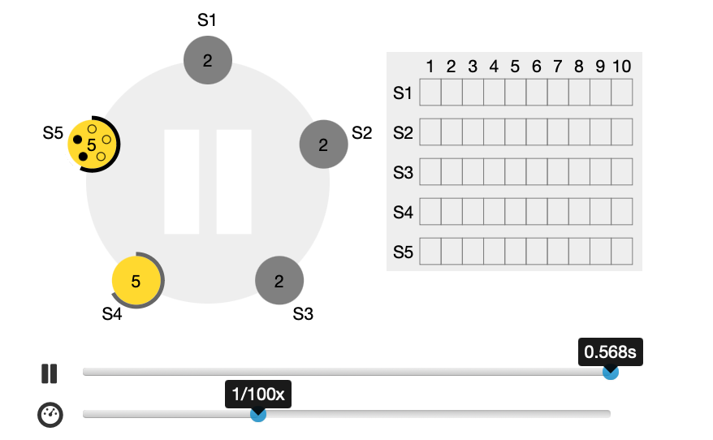
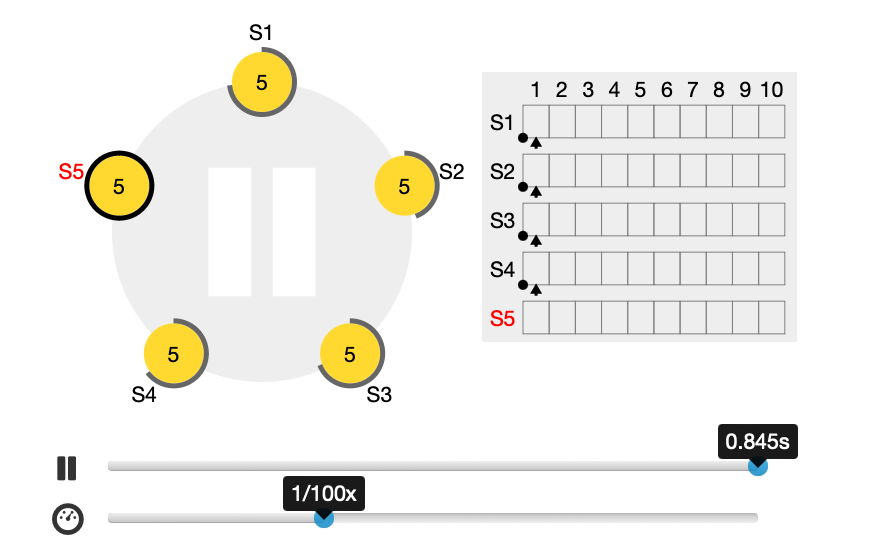

Assignment 5 
---------------------

# Team Members

- Emma Kozmmér
- Luisa Ella Mueller

# GitHub link to your (forked) repository

https://github.com/luisaellamaria/Assignment5.git

# Task 1

Note: Some questions require you to take screenshots. In that case, please join the screenshots and indicate in your answer which image refer to which screenshot.
1. What happens when Raft starts? Explain the process of electing a leader in the first term.

Ans:
- Leader election: First of all, when Raft starts, all nodes start as followers and wait for messages (heartbeats) from a leader. If followers don't hear from a leader within a certain timeframe (election timeout) it is clear that no leader exists. Therefore, the current node is supposed to change to a candidate and start a new election term. The candidate requests votes from other nodes. Nodes will reply with their vote based on criteria like completeness of the candidate’s log and whether they have voted in that term. The candidate becomes the leader if it gets votes from a majority of nodes. Once the leader is elected, all changes to the system now go through the leader (it starts sending heartbeats) to maintain authority and prevent new elections.

Note: we got this information from the link which was provided to us: https://thesecretlivesofdata.com/raft/ there we followed the step by step explanation of each step in the election process.

2. Perform one request on the leader, wait until the leader is committed by all servers. Pause the simulation. Then perform a new request on the leader. Take a screenshot, stop the leader and then resume the simulation. Once, there is a new leader, perform a new request and then resume the previous leader. Once, this new request is committed by all servers, pause the simulation and take a screenshot. Explain what happened?

Ans: 
- First of all, we performed a request on the existing leader (S1) and the leader (S1) replicated the entry to the other nodes. The entry was committed once a majority of nodes have written it to their logs, represented by the solid borders around the  first logs (which are for all nodes a 2).  The simulation was then paused and a new request on the same leader (S1) was performed. Then, we paused the simulation and performed a new request on the leader.  Since it was not defined to wait in the instruction we immediately took a screenshot (task1_q2_1.png (also provided in our images folder)). On the screenshot there is one column where all logs are surrounded by solid borders, indicating that replication has been completed and the entries has been committed by all nodes. In the second column only the leader log is surrounded by a solid column and the other logs are surrounded by dotted boarders, indicating that the leader was not committed by the servers yet but if we run the simulation further we will get also those solid boarders like for the first column.
- Further, we stopped the leader and resumed the simulation. We performed a new request on the new leader and paused the simulation once the request was committed by all servers. The result of this process can be seen in our second screenshot (task1_q2_2.png (also provided in our images folder)).  In the screenshot we can inspect that due to the stop of the first leader (S1) a new leader (S3) was selected in a new term. Since the previous leader (S1) was then resumed, the new leader (S4) was able to be committed by all other nodes (including the previous leader). This commitment can be seen by the solid boarders around all the third logs of all (green) nodes. 

=> The whole process illustrated how the Raft algorithm handles leader failures maintaining integrity and consistency. When a leader fails (is stopped), the remaining nodes can conduct a new leader election.

3. Stop the current leader and two other servers. After a few increase in the Raft term, pause the simulation and take a screenshot. Then resume all servers and restart the simulation. After the leader election, pause the simulation and take a screenshot. Explain what happened.

Ans:
- After we let the two servers running during a few term increments, we observed a behavioural pattern. The terms kept increasing  (as nodes continually attempt to elect a leader) but no new leader can be elected, because in Raft a majority of nodes is required to make decisions.  Hence, the process was kind of stuck, leading to no solid border around any new entries in the logs, indicating no new leader has been elected and no new entries have been committed.  This can be seen in the screenshot (task1_q3_1.png (also provided in our images folder)).   
- Once al the servers were resumed, they were able to communicate again and hold a new leader election. So, node S5 was chosen as the new leader. The screenshot for this part shows a new term with a leader elected (indicated by the number in a circle on one of the servers)  (task1_q3_2.png (also provided in our images folder)). If a new request was performed on the new leader the entries would be replicated and committed. 

=> The whole process illustrated the Raft algorithm's requirement for a majority of nodes to be operational to maintain the system's reliability and functionality.

# Task 2

Indicate the replies that you get from the "/admin/status" endpoint of the HTTP service for each servers. Which server is the leader? Can there be multiple leaders?

Ans: We got the following replies from the "/admin/status" endpoint of the HTTP service for each servers:

- Request 1: http://localhost:8080/admin/status: 
{'version': '0.3.12', 'revision': 'deprecated', 'self': TCPNode('127.0.0.1:6000'), 'state': 2, 'leader': TCPNode('127.0.0.1:6000'), 'has_quorum': True, 'partner_nodes_count': 2, 'partner_node_status_server_127.0.0.1:6001': 2, 'partner_node_status_server_127.0.0.1:6002': 2, 'readonly_nodes_count': 0, 'log_len': 2, 'last_applied': 6, 'commit_idx': 6, 'raft_term': 1, 'next_node_idx_count': 2, 'next_node_idx_server_127.0.0.1:6001': 7, 'next_node_idx_server_127.0.0.1:6002': 7, 'match_idx_count': 2, 'match_idx_server_127.0.0.1:6001': 6, 'match_idx_server_127.0.0.1:6002': 6, 'leader_commit_idx': 6, 'uptime': 605, 'self_code_version': 0, 'enabled_code_version': 0}

- Request 2: http://localhost:8081/admin/status:
{'version': '0.3.12', 'revision': 'deprecated', 'self': TCPNode('127.0.0.1:6001'), 'state': 0, 'leader': TCPNode('127.0.0.1:6000'), 'has_quorum': True, 'partner_nodes_count': 2, 'partner_node_status_server_127.0.0.1:6000': 2, 'partner_node_status_server_127.0.0.1:6002': 2, 'readonly_nodes_count': 0, 'log_len': 2, 'last_applied': 6, 'commit_idx': 6, 'raft_term': 1, 'next_node_idx_count': 0, 'match_idx_count': 0, 'leader_commit_idx': 6, 'uptime': 624, 'self_code_version': 0, 'enabled_code_version': 0}

- Request 3: http://localhost:8082/admin/status:
{'version': '0.3.12', 'revision': 'deprecated', 'self': TCPNode('127.0.0.1:6002'), 'state': 0, 'leader': TCPNode('127.0.0.1:6000'), 'has_quorum': True, 'partner_nodes_count': 2, 'partner_node_status_server_127.0.0.1:6001': 2, 'partner_node_status_server_127.0.0.1:6000': 2, 'readonly_nodes_count': 0, 'log_len': 2, 'last_applied': 6, 'commit_idx': 6, 'raft_term': 1, 'next_node_idx_count': 0, 'match_idx_count': 0, 'leader_commit_idx': 6, 'uptime': 636, 'self_code_version': 0, 'enabled_code_version': 0}

- From this responses we can read in every response that 'leader': TCPNode('127.0.0.1:6000‘). Therefore server 0 at the port 8080 is our leader.

- Since this is the Raft algorithm it is not possible to have multiple leaders. In a well functioning system, Raft is designed to ensure that there is only one leader in any given term, a period during which a leader is elected and remains in charge unless it fails or becomes disconnected.

2. Perform a Put request for the key ``a" on the leader. What is the new status? What changes occurred and why (if any)?
Ans:
System state before PUT request:
{
  "version": "0.3.12",
  "revision": "deprecated",
  "self": TCPNode('127.0.0.1:6000'),
  "state": 2,
  "leader": TCPNode('127.0.0.1:6000'),
  "has_quorum": true,
  "partner_nodes_count": 2,
  "partner_node_status_server_127.0.0.1:6001": 2,
  "partner_node_status_server_127.0.0.1:6002": 2,
  "readonly_nodes_count": 0,
  "log_len": 2,
  "last_applied": 2,
  "commit_idx": 2,
  "raft_term": 1,
  "next_node_idx_count": 2,
  "next_node_idx_server_127.0.0.1:6001": 3,
  "next_node_idx_server_127.0.0.1:6002": 3,
  "match_idx_count": 2,
  "match_idx_server_127.0.0.1:6001": 2,
  "match_idx_server_127.0.0.1:6002": 2,
  "leader_commit_idx": 2,
  "uptime": 92,
  "self_code_version": 0,
  "enabled_code_version": 0
}

System state after PUT request:
{
  "version": "0.3.12",
  "revision": "deprecated",
  "self": TCPNode('127.0.0.1:6000'),
  "state": 2,
  "leader": TCPNode('127.0.0.1:6000'),
  "has_quorum": true,
  "partner_nodes_count": 2,
  "partner_node_status_server_127.0.0.1:6001": 2,
  "partner_node_status_server_127.0.0.1:6002": 2,
  "readonly_nodes_count": 0,
  "log_len": 3,
  "last_applied": 3,
  "commit_idx": 3,
  "raft_term": 1,
  "next_node_idx_count": 2,
  "next_node_idx_server_127.0.0.1:6001": 4,
  "next_node_idx_server_127.0.0.1:6002": 4,
  "match_idx_count": 2,
  "match_idx_server_127.0.0.1:6001": 3,
  "match_idx_server_127.0.0.1:6002": 3,
  "leader_commit_idx": 3,
  "uptime": 123,
  "self_code_version": 0,
  "enabled_code_version": 0
}

Status: 200

Changes: 
- Firstly, we noticed a change in the log length. Before it was 2 and after it was 3. We assumed that this change indicates to the new entry added due to the PUT request.
- Secondly, we noticed a change in the last applied value also from 2 to 3. This indicates that a new log entry has been applied to the state machine.
- Then we also noticed a change in the commit index also from 2 to 3. The commit index has advanced, confirming the new log entry is committed.
- Further, we noticed a change in the next node index before it was for 6001 and 6002 3 and after it was 4. We assumed that the leaders next index for each follower has increased, indicating new log entry sent to followers.
- There is also a change in the match_idx_server which was 2 for 6001 and 6002 before and after it was 3. This shows that followers have replicated the new log entry, updating their match index.
- Also the leader commit index changed from 2 to 3, indicating that the leader has advanced its commit index post successful replication.
- Lastly, the uptime changed from 92 seconds to 123 second, which is due to the time which passed.

All the other parameters remained unchanged, as expected for static or less frequently changing system aspects.

4. Perform an Append request for the key ``a" on the leader. What is the new status? What changes occurred and why (if any)?
Ans:
System state before APPEND request:
 {
  "version": "0.3.12",
  "revision": "deprecated",
  "self": TCPNode('127.0.0.1:6000'),
  "state": 2,
  "leader": TCPNode('127.0.0.1:6000'),
  "has_quorum": true,
  "partner_nodes_count": 2,
  "partner_node_status_server_127.0.0.1:6001": 2,
  "partner_node_status_server_127.0.0.1:6002": 2,
  "readonly_nodes_count": 0,
  "log_len": 3,
  "last_applied": 3,
  "commit_idx": 3,
  "raft_term": 1,
  "next_node_idx_count": 2,
  "next_node_idx_server_127.0.0.1:6001": 4,
  "next_node_idx_server_127.0.0.1:6002": 4,
  "match_idx_count": 2,
  "match_idx_server_127.0.0.1:6001": 3,
  "match_idx_server_127.0.0.1:6002": 3,
  "leader_commit_idx": 3,
  "uptime": 123,
  "self_code_version": 0,
  "enabled_code_version": 0
}

System state after APPEND request:
{
  "version": "0.3.12",
  "revision": "deprecated",
  "self": TCPNode('127.0.0.1:6000'),
  "state": 2,
  "leader": TCPNode('127.0.0.1:6000'),
  "has_quorum": true,
  "partner_nodes_count": 2,
  "partner_node_status_server_127.0.0.1:6001": 2,
  "partner_node_status_server_127.0.0.1:6002": 2,
  "readonly_nodes_count": 0,
  "log_len": 3,
  "last_applied": 4,
  "commit_idx": 4,
  "raft_term": 1,
  "next_node_idx_count": 2,
  "next_node_idx_server_127.0.0.1:6001": 5,
  "next_node_idx_server_127.0.0.1:6002": 5,
  "match_idx_count": 2,
  "match_idx_server_127.0.0.1:6001": 4,
  "match_idx_server_127.0.0.1:6002": 4,
  "leader_commit_idx": 4,
  "uptime": 716,
  "self_code_version": 0,
  "enabled_code_version": 0
}

Status: 200

Changes:
- Firstly, the last_applied value changed from 3 to 4, which indicates that the commit index has increased, meaning a new log entry is now considered committed.
- Then, the next_node_idx for both servers changed from 4 to 5, indication that the leader's next index for each follower has increased, likely indicating that it has sent another new log entry to the followers.
- Then, the match_idx for both servers changed, indication that the followers have replicated an additional new log entry, hence their match index has been updated.
- Further, the leader_commit_idx changed from 3 to 4, indicating that the leader has advanced its commit index, confirming successful replication of the new log entry.
- And then also the uptime increased for obvious reasons.

All other parameters remained unchanged.

6. Perform a Get request for the key ``a" on the leader. What is the new status? What change (if any) happened and why?
Ans:
System State before GET request:
{
  "version": "0.3.12",
  "revision": "deprecated",
  "self": TCPNode('127.0.0.1:6000'),
  "state": 2,
  "leader": TCPNode('127.0.0.1:6000'),
  "has_quorum": true,
  "partner_nodes_count": 2,
  "partner_node_status_server_127.0.0.1:6001": 2,
  "partner_node_status_server_127.0.0.1:6002": 2,
  "readonly_nodes_count": 0,
  "log_len": 4,
  "last_applied": 4,
  "commit_idx": 4,
  "raft_term": 1,
  "next_node_idx_count": 2,
  "next_node_idx_server_127.0.0.1:6001": 5,
  "next_node_idx_server_127.0.0.1:6002": 5,
  "match_idx_count": 2,
  "match_idx_server_127.0.0.1:6001": 4,
  "match_idx_server_127.0.0.1:6002": 4,
  "leader_commit_idx": 4,
  "uptime": 12,
  "self_code_version": 0,
  "enabled_code_version": 0
}

System State after GET request:

{
  "version": "0.3.12",
  "revision": "deprecated",
  "self": TCPNode('127.0.0.1:6000'),
  "state": 2,
  "leader": TCPNode('127.0.0.1:6000'),
  "has_quorum": true,
  "partner_nodes_count": 2,
  "partner_node_status_server_127.0.0.1:6001": 2,
  "partner_node_status_server_127.0.0.1:6002": 2,
  "readonly_nodes_count": 0,
  "log_len": 4,
  "last_applied": 4,
  "commit_idx": 4,
  "raft_term": 1,
  "next_node_idx_count": 2,
  "next_node_idx_server_127.0.0.1:6001": 5,
  "next_node_idx_server_127.0.0.1:6002": 5,
  "match_idx_count": 2,
  "match_idx_server_127.0.0.1:6001": 4,
  "match_idx_server_127.0.0.1:6002": 4,
  "leader_commit_idx": 4,
  "uptime": 30,
  "self_code_version": 0,
  "enabled_code_version": 0
}

Status: 200

Changes:
- The only change is that the up-time increased for obvious reasons. Everything else remains unchanged which is due to the nature of a GET request is a read operation and typically does not alter the parameters.

# Task 3

1. Shut down the server that acts as a leader. Report the status that you get from the servers that remain active after shutting down the leader.

Ans:

Followers after shutting down the leader:
Follower at 127.0.0.1:6001
{
  "version": "0.3.12",
  "revision": "deprecated",
  "self": TCPNode('127.0.0.1:6001'),
  "state": 0,
  "leader": TCPNode('127.0.0.1:6000'),
  "has_quorum": true,
  "partner_nodes_count": 2,
  "partner_node_status_server_127.0.0.1:6002": 2,
  "partner_node_status_server_127.0.0.1:6000": 2,
  "readonly_nodes_count": 0,
  "log_len": 4,
  "last_applied": 4,
  "commit_idx": 4,
  "raft_term": 1,
  "next_node_idx_count": 0,
  "match_idx_count": 0,
  "leader_commit_idx": 4,
  "uptime": 247,
  "self_code_version": 0,
  "enabled_code_version": 0
}

Follower at 127.0.0.1:6002
{
  "version": "0.3.12",
  "revision": "deprecated",
  "self": TCPNode('127.0.0.1:6001'),
  "state": 2,
  "leader": TCPNode('127.0.0.1:6001'),
  "has_quorum": true,
  "partner_nodes_count": 2,
  "partner_node_status_server_127.0.0.1:6002": 2,
  "partner_node_status_server_127.0.0.1:6000": 0,
  "readonly_nodes_count": 0,
  "log_len": 5,
  "last_applied": 5,
  "commit_idx": 5,
  "raft_term": 3,
  "next_node_idx_count": 2,
  "next_node_idx_server_127.0.0.1:6002": 6,
  "next_node_idx_server_127.0.0.1:6000": 5,
  "match_idx_count": 2,
  "match_idx_server_127.0.0.1:6002": 5,
  "match_idx_server_127.0.0.1:6000": 0,
  "leader_commit_idx": 5,
  "uptime": 288,
  "self_code_version": 0,
  "enabled_code_version": 0
}
 

- The first follower (127.0.0.1:6001) has assumed the leader role (state: 2) and sees itself as the leader. So, a new leader election has taken place. The second follower (127.0.0.1:6002) remains a follower (state: 0) and recognizes the first follower as the new leader.

2. Perform a Put request for the key "a". Then, restart the server from the previous point, and indicate the new status for the three servers. Indicate the result of a Get request for the key ``a" to the previous leader.

Ans:
State before the PUT request and restart:
Server 6001 (Leader):
- State: Leader (state = 2)
- Log Length: 2
- Last Applied: 5
- Commit Index: 5
- Partner Node Status: Server 6002 (state = 2), Server 6000 (state = 0)

Server 6002 (Follower):
- State: Follower (state = 0)
- Log Length: 2
- Last Applied: 5
- Commit Index: 5

Server 6000 (Follower, but with outdated state):
- State: Follower (state = 0)
- Log Length: 2
- Last Applied: 5
- Commit Index: 5

State after the PUT request and the restart:
Server 6000:
- State: Follower (state = 0)
- Log Length: 3 (indicating it has received a new log entry)
- Last Applied: 6
- Commit Index: 6

Server 6001 (Still the Leader):
- State: Leader (state = 2)
- Log Length: 3
- Last Applied: 6
- Commit Index: 6
  
Server 6002 (Follower):
- State: Follower (state = 0)
- Log Length: 3
- Last Applied: 6
- Commit Index: 6

The PUT request was made to the leader and then replicated to the followers. Server 6000, after being restarted, caught up with the latest changes. It updated its log length, last applied, and commit index to reflect the new state of the log. All servers now have a log length of 3, indicating that they are all up-to-date with the latest log entry.

If now a GET request  for the key “a” to the previous leader (Server 6001) would be performed, it should return the value that was set in the most recent PUT request. This is because the leader ahs the most up-to-date state of the log, and the PUR request was successfully replicated to the other servers. 

3. Has the Put request been replicated? Indicate which steps lead to a new election and which ones do not. Justify your answer using the statuses returned by the servers.

Ans: Yes, the PUT request was successfully replicated. There are no steps in this scenario that lead to a new election. The leader (Server 6001) remains the same throughout the process. Usally : when the old leader dies. Steps that Do Not Lead to a New Election: The PUT request and the server restart do not lead to a new election. The system maintains its leader and replicates the new log entry without triggering a leadership change.

4. Shut down two servers, including the leader --- starting with the server that is not the leader. Report the status of the remaining server  and explain what happened.

Ans:

5. Can you perform Get, Put, or Append requests in this system state? Justify your answer.

Ans:

This action would typically lead to a re-election process in a distributed consensus algorithm like Raft, but with only one remaining server, no leader can be elected, and the system cannot reach a consensus.

After shutting down two servers, including the leader, the remaining server will be unable to elect a new leader because it's alone in the network (lacks quorum). 

In this state, the system is in a leaderless state and lacks quorum, so it cannot safely perform operations that require consensus, like Put or Append. These operations need a leader to coordinate the consensus process. 

When we try out the get request, we do not receive the desired update according to the put / append operation. 
Therefore, we can perform a get but the get is not successful as it does not contain the expected information 

 

6. Restart the servers and note down the new status. Describe what happened.

Ans:
Here, I have the two status from te remaining node, one with o partner nodes, one after restarting partner nodes servers ( set up from beginning ) 

Before: 
{
  "version": "0.3.12",
  "revision": "deprecated",
  "self": "TCPNode('127.0.0.1:6002')",
  "state": 2,
  "leader": "TCPNode('127.0.0.1:6002')",
  "has_quorum": false,
  "partner_nodes_count": 2,
  "partner_node_status": {
    "server_127.0.0.1:6001": 0,
    "server_127.0.0.1:6000": 0
  },
  "readonly_nodes_count": 0,
  "log_len": 4,
  "last_applied": 4,
  "commit_idx": 4,
  "raft_term": 4,
  "next_node_idx_count": 2,
  "next_node_idx": {
    "server_127.0.0.1:6001": 5,
    "server_127.0.0.1:6000": 5
  },
  "match_idx_count": 2,
  "match_idx": {
    "server_127.0.0.1:6001": 4,
    "server_127.0.0.1:6000": 4
  },
  "leader_commit_idx": 4,
  "uptime": 108,
  "code_version": {
    "self": 0,
    "enabled": 0
  }
}

After: 

{
  "version": "0.3.12",
  "revision": "deprecated",
  "self": "TCPNode('127.0.0.1:6002')",
  "state": 2,
  "leader": "TCPNode('127.0.0.1:6002')",
  "has_quorum": true,
  "partner_nodes_count": 2,
  "partner_node_status": {
    "server_127.0.0.1:6001": 2,
    "server_127.0.0.1:6000": 2
  },
  "readonly_nodes_count": 0,
  "log_len": 5,
  "last_applied": 5,
  "commit_idx": 5,
  "raft_term": 5,
  "next_node_idx_count": 2,
  "next_node_idx": {
    "server_127.0.0.1:6001": 6,
    "server_127.0.0.1:6000": 6
  },
  "match_idx_count": 2,
  "match_idx": {
    "server_127.0.0.1:6001": 5,
    "server_127.0.0.1:6000": 5
  },
  "leader_commit_idx": 5,
  "uptime": 147,
  "code_version": {
    "self": 0,
    "enabled": 0
  }
}

What we can notice: 

Initially, when one node is alone, theere is no  quorum and no partner nodes anymore. (partner_node_status_server values are 0). After restarting the other two servers, we can notice how the node that waws remainng aloe before has become a functioning leader with the restarted servers as partner nodes. The cluster achieved a quorum and the partner nodes are operational (partner_node_status_server values are 2).

# Task 4

1. What is a consensus algorithm? What are they used for in the context of replicated state machines? 

Ans: A consensus algorithm is a process used to achieve agreement on a single data value among distributed processes or systems. Consunsus Algorithms have been designed to coordinate the system's processes to agree on data value and how that will be used in the system. It ensures that network activities are done in a secure and reliable manner which establishes trust among peers in the network. A replicated state machine is a deterministic state machine where multiple machines have the same state and run the same. 

"What are they used for in the context of replicated state machines?" - They are important in distributed systems to ensure that each node maintains an identical copy of a particular state. 
They are important to coordinate updates. When changes to the state are required (like a new transaction in a distributed ledger), all nodes must agree on the order and content of these changes. A consensus algorithm ensures that all nodes agree on the sequence of actions that modify the state. Consensus algorithns are also important to handle failures. In distributed systems, nodes can fail, become unresponsive, or even act maliciously. Consensus algorithms are designed to handle these issues by ensuring that the overall system continues to operate correctly and agree on the state, even if some nodes are not functioning properly.

Note: most of the information about consensus algorithms we got from here: https://www.techtarget.com/whatis/definition/consensus-algorithm#:~:text=A%20consensus%20algorithm%20is%20a,among%20distributed%20processes%20or%20systems.

2. What are the main features of the Raft algorithm? How does Raft enable fault tolerance?

Ans: Raft uses a well-defined leader election process. When the current leader fails or becomes unreachable, a new leader is elected, ensuring continuous coordination among nodes. The leader is responsible for log replication. All changes to the state are first made on the leader's log, then replicated to the follower nodes, ensuring consistency across the cluster. Raft ensures that if any node has applied a particular log entry to its state machine, then other nodes won't apply a different command for the same log index. This guarantees consistency across the system. Raft forces the logs of the followers to match those of the leader. If a follower's log diverges, the leader overwrites it with its own data, ensuring all nodes maintain identical logs. Before a leader can consider a log entry as committed, it must first store entries from previous leaders. This ensures data consistency across leader changes.

Note: we learned about Raft from the lecture slides (week 9)

3. What are Byzantine failures? Can Raft handle them?

Ans: Byzantine failures, named after the Byzantine Generals' Problem, represent one of the most challenging class of failures in distributed systems. They describe a situation where components of a system fail in arbitrary or unpredictable and malicious ways, which can include disinformation, sending conflicting information to different parts of the system, or working to actively undermine the system's operation. This is different from standard failures where a component simply stops working or responds with an error.

"Can Raft handle them?" - No, Raft's initial description is not byzantine fault-tolerant. If a node that votes two times in a given term, or votes for some node that has an information which is not updated and that node becomes leader. Such behaviour could cause inconsistencies in the log or could lead to two nodes that both believe themselves to be leaders. In order to make the Raft Byzantine fault tolerant, there must be many significant changes to the algorithm.
However, after doing some research, we have an interesting paper which describes how one could make it fault tolerant: https://www.scs.stanford.edu/17au-cs244b/labs/projects/clow_jiang.pdf

